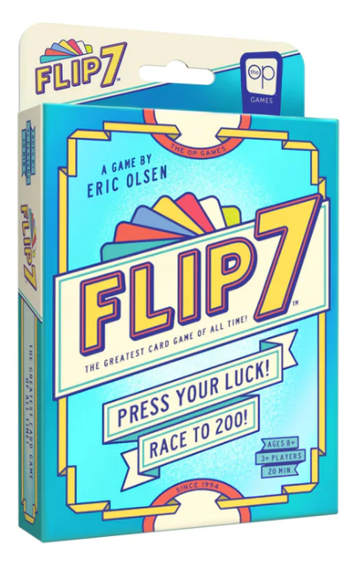

# Flip 7 Card Game

A browser-based prototype inspired by the push-your-luck card game **Flip 7**. Players take turns drawing cards, trying to collect seven unique number cards without revealing a duplicate.



## How to play

This version runs as a local three-player pass-and-play game:

1. Click the deck to draw a card for the highlighted player.
2. Avoid drawing a number already held by that player—a duplicate knocks them out of the round.
3. Click **Skip** to stop drawing and pass the turn.
4. A player is also finished when they collect seven unique number cards.
5. When the round ends, use **Reset** to shuffle a new deck and play again.

## Current features

- Shuffled deck with number cards from 0 to 12
- Three-player turn rotation
- Animated card dealing and player highlighting
- Duplicate-number detection
- Seven-card completion detection
- Flip Three, Freeze, and Second Chance cards
- `+2`, `+4`, `+6`, `+8`, `+10`, and `×2` modifier cards
- Remaining-card counter and round reset

> [!NOTE]
> This is an early prototype. Special and modifier cards are included in the deck and rendered on the board, but their gameplay effects are not implemented yet. Scoring, winner calculation, and complete official rules are also still to come.

## Tech stack

- [Next.js](https://nextjs.org/) 16
- [React](https://react.dev/) 19
- [TypeScript](https://www.typescriptlang.org/)
- [Tailwind CSS](https://tailwindcss.com/) 4
- [Motion](https://motion.dev/) for card animations

## Getting started

Install the dependencies:

```bash
npm install
```

Start the development server:

```bash
npm run dev
```

Open [http://localhost:3000](http://localhost:3000) in your browser.

## Available scripts

```bash
npm run dev    # Start the development server
npm run build  # Create a production build
npm run start  # Run the production build
npm run lint   # Check the code with ESLint
```

## Project structure

```text
app/
├── assets/cards/     # Number, action, modifier, and card-back artwork
├── components/       # Reusable UI components
├── globals.css       # Global styles and Tailwind setup
├── layout.tsx        # Root application layout
└── page.tsx          # Game state, rules, controls, and board UI
```

## Roadmap

- Apply action-card effects
- Calculate round and total scores
- Add player names and configurable player counts
- Improve responsive layouts for smaller screens
- Add clearer round results and winner states
- Add automated tests for deck and rule logic

## Disclaimer

This is an unofficial fan-made project created for learning and experimentation. Flip 7 and its associated trademarks belong to their respective owners.
